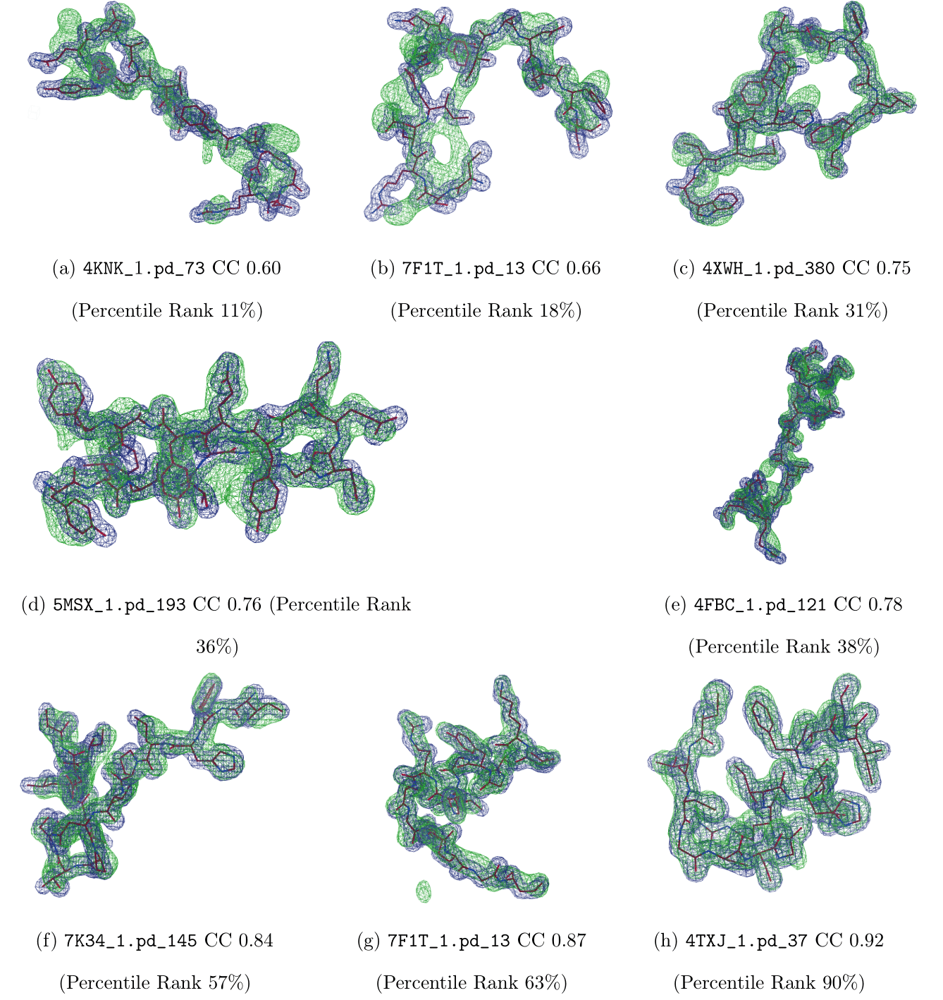

# CrysFormer: Protein Structure Determination via Patterson Maps, Deep Learning and Partial Structure Attention

## Description
Determining the atomic-level structure of a protein has been a decades-long challenge. 
However, recent advances in transformers and related neural network architectures have enabled researchers to significantly improve solutions to this problem. 
These methods use large datasets of sequence information and corresponding known protein template structures, if available.
Yet, such methods only focus on sequence information. 
Other available prior knowledge could also be utilized, such as constructs derived from X-ray crystallography experiments and the known structures of the most common conformations of amino acid residues, which we refer to as partial structures. 
To the best of our knowledge, we propose the first transformer-based model that directly utilizes experimental protein crystallographic data and partial structure information to calculate electron density maps of proteins. 
In particular, we use Patterson maps which can be directly obtained from X-ray crystallography experimental data, thus bypassing the well-known crystallographic phase problem. 
We demonstrate that our method, CrysFormer, achieves precise predictions on two synthetic datasets of peptide fragments in crystalline forms, one with two residues per unit cell and the other with fifteen. 
These predictions can then be used to generate accurate atomic models using established crystallographic refinement programs.

<p align="center">
  
</p>

## Dataset Generation

Extract the protein fragment files in pdb.tar.bz into 2_pdb_reweight_allatom_clean_reorient_center.  Then, run all step*_mpi.slurm scripts in the datagen directory in order (steps 4/5 can be performed in parallel, as can 6/7 and 8/9). Steps 3, 4, 5 require that the ccp4 program suite (https://www.ccp4.ac.uk/) is installed, as they make use of ccp4 command-line tools.  Replace the "source /path/to/ccp4-<version>/bin/ccp4.setup-sh" line in those scripts with a line corresponding to the installed version of ccp4.

## Environment/Dependencies
Requires Torch version >= 1.12.0 and einops version >= 0.6.0.

## Training

For the initial training run, call "python3 train_initial.py".  To generate model predictions from the initial training run, call "python3 get_predictions.py".  Afterwards, for the recycling training run, call "python3 train_recycle.py".

## File Arrangement

```
+-- get_predictions.py : Creates electron density predictions for all training and test set examples based on the saved model state after the initial training run
+-- pdb.tar.bz : Compressed archive of full set of processed protein fragment files in .pdb format
+-- train_initial.py : Training script for initial training run
+-- train_recycle.py : Training script for recycling training run
+-- 2_pdb_reweight_allatom_clean_reorient_center/ : A few examples of our protein fragment files
|   +-- README.md: Description of the nomenclature for our example identifiers
+-- 9_electron_density_pt_scaled/ : Standardized electron densities of proteinogenic amino acid residues (i.e. "partial structures")
+-- autobuild/ : Scripts for performing our autobuild refinement runs, see README.txt for additional details
+-- batchgen/ : Scripts for generating training "batches" during inital and recycling training runs
+-- datagen/ : Scripts and helper files for generating model input and output tensors from protein fragment files
|   +-- command_step4.txt: Specifies input keywords for generating Patterson maps from structure factors using the FFT program from the CCP4 suite
|   +-- convert_ccp4_to_pt*.py: Helper Python scripts for creating Torch tensors from electron density maps
|   +-- scaling_tensor*.py: Helper Python scripts for normalizing Torch tensors
|   +-- split_*.txt: Files that contain identifiers for all training and test set examples
|   +-- step3_mpi.slurm: Generates structure factors from protein fragment files using the gemmi program from the CCP4 suite
|   +-- step4_mpi.slurm: Generates Patterson maps from structure factors using the FFT program 
|   +-- step5_mpi.slurm: Generates electron density maps from structure factors using the FFT program 
|   +-- step6_mpi.slurm: Converts Patterson maps to Torch tensors
|   +-- step7_mpi.slurm: Converts electron density maps to Torch tensors
|   +-- step8_mpi.slurm: Normalizes tensors derived from Patterson maps
|   +-- step9_mpi.slurm: Normalizes tensors derived from electron density maps
+-- electron_density_pt_scaled_newps/ : Directory where normalized electron density tensors will be placed (contains dummy file)
+-- example_ids/ : Various files that specify the training and test set examples, and training batches
|   +-- new-dipeptide-AA-type-noclash_new2.list: Lists the 15-residue primary amino acid sequence for all training and test set examples
|   +-- size_indices_new1.txt: Lists indices that delimit training set examples of different shapes (for this dataset, all examples have the same shape)
|   +-- test_new_dataset2.txt: Lists test set examples
|   +-- train_new_dataset2.txt: Lists training set examples
|   +-- training_indices_new2.txt: Lists indices that delimit training batches
+-- model/ : Files that specify our model architecture and modified Nyström attention (derived from https://github.com/lucidrains/nystrom-attention)
+-- patterson_pt_scaled_newps/ : Directory where normalized Patterson tensors will be placed (contains dummy file)
+-- predictions/ : Directory where model predictions after the initial training run will be placed (contains dummy file)
+-- shelxe/ : Script for performing our shelxe poly-alanine tracing run, see README.txt for additional details
```
